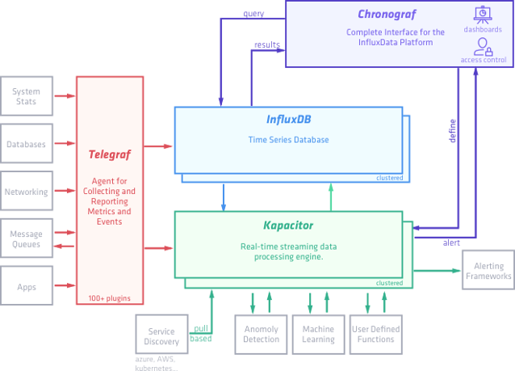

# TICK Stack

* Telegraf
* InfluxDB
* Chronograf
* Kapacitor

<p align="center">
  
</p>

# How to use

## Terraform

* Update variables.tfvars with your own AWS credentials
* Install AWS plugin:

```
$ terraform init
```

* Create the AWS resources:

```
$ terraform apply -var-file=variables.tfvars
```

## Ansible

* Install Role:

```
$ ansible-galaxy install mlabouardy.tick
```

* Execute playbook:

```
$ ansible-playbook --private-key=aws.pem -i inventory playbook.yml
```
